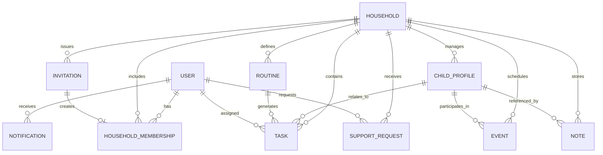

# Business Relationships

## Context Status

The formal WOW Mom App specification was not present in the workspace. The relationships below model likely domain connections and identify what should be validated once the source specification is available.

## Entity Relationship Summary

### User To Household

Relationship:

- many-to-many through Household Membership

Meaning:

- a user can belong to multiple households
- a household can have multiple participating users
- each membership carries role, permissions, status, and optional expiration

Business significance:

- most authorization decisions should be scoped through household membership
- the same person may have different responsibilities in different households

### Household To Child Profile

Relationship:

- one-to-many

Meaning:

- a household can manage one or more child profiles
- each child profile belongs to one primary household unless shared custody or cross-household linking is explicitly required

Business significance:

- child data is sensitive and should have role-based visibility
- tasks, events, routines, and notes may reference a child profile

### Household To Task

Relationship:

- one-to-many

Meaning:

- tasks are created inside a household context
- tasks may be assigned to users with household membership

Business significance:

- task assignment should respect member permissions
- completion history helps build accountability and coordination

### Routine To Task / Reminder

Relationship:

- one-to-many generated relationship

Meaning:

- routines can produce task instances or reminders over time

Business significance:

- recurring behavior should be handled consistently
- timezone and schedule edge cases are likely important

### Event To Participants

Relationship:

- many-to-many between events and users
- optional relationship to child profile

Meaning:

- events can include household members, caregivers, or support members
- events may be child-specific or household-wide

Business significance:

- changes must notify affected participants
- external caregivers may only see events relevant to them

### Support Request To Responder

Relationship:

- one support request may receive zero, one, or many responses
- one accepted response may designate the fulfilling caregiver

Meaning:

- support requests are open until accepted, canceled, expired, or fulfilled

Business significance:

- response tracking prevents duplicate or unclear commitments
- accepted requests may convert into tasks or events

### Invitation To Membership

Relationship:

- invitation creates at most one household membership when accepted

Meaning:

- invitations are the entry mechanism for non-owner participants

Business significance:

- intended role should be captured before acceptance
- expired or revoked invitations must not grant access

### Note To Visibility Scope

Relationship:

- note belongs to a household and may be linked to child, task, event, or support request
- note has a visibility scope

Meaning:

- notes can be private, shared with household admins, shared with all household members, or shared with selected caregivers

Business significance:

- privacy defaults matter
- sensitive notes should not be exposed through broad role assumptions

### Notification To Domain Object

Relationship:

- notification belongs to a recipient user
- notification may reference a task, event, invitation, support request, routine, or note

Meaning:

- notifications are derived from workflow events

Business significance:

- notifications should not reveal information the recipient cannot otherwise access

## Business Rule Candidates

- A household must have at least one owner or administrator.
- Only authorized household members can invite new members.
- Role assignment is scoped to the household.
- Child profile visibility must be explicitly controlled.
- Temporary caregivers should have limited and expiring access.
- Support requests can be canceled by the requester.
- Accepted support requests should prevent conflicting duplicate acceptance unless multi-person help is allowed.
- Routine-generated tasks should preserve a link to the routine that created them.
- Notification payloads must respect authorization and privacy boundaries.
- Audit logs may be required for membership, child data access, and permission changes.

## Relationship Diagram

## Open Questions

- Does the business model include paid subscriptions or plans?
- Are support members internal household invitees, public community members, or marketplace providers?
- Are providers and vendors first-class business entities?
- Does the app need compliance-grade audit logging?
- Can child profiles be shared across households?
- Are there organization-level roles beyond household-level roles?

